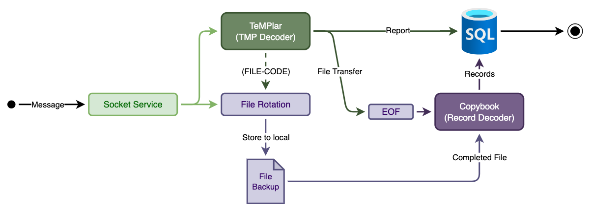
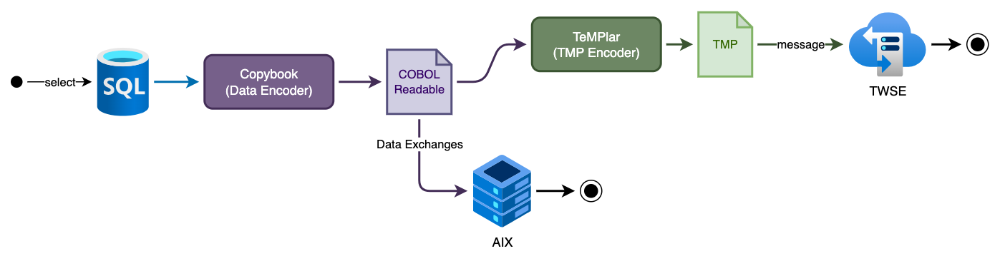
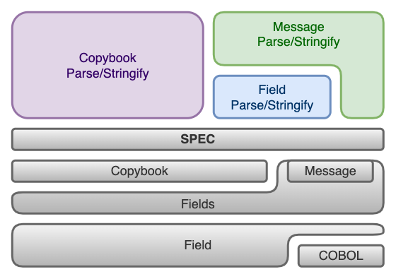

# TeMPlar
`TMP`是臺灣證券交易所（TWSE）所使用的專屬傳輸協定，全名為`Transaction Message Protocol`，用於證券交易相關的訊息傳輸。此工具用於解析TMP提供的`委託`/`成交`/`申報`/`檔案傳輸`服務訊息內容，將序列化的字串資料轉為非序列化的資料物件後再加以利用。非序列化的資料亦可使用此工具轉換成`COBOL`可處理的序列化字串資料以用於系統間的資料交換。

<br>




<br>

# 使用方式

```js
const templar = require('templar');
```

檔案傳輸
```js
const message = templar.parse('20020508595900000084500003M01', { category: 'file-transfer' }

console.log(message);

// Message_t {
//   body: [ { FileCode: 'M01', ResponseMessage: '' } ],
//   raw: Uint8Array('20000008595900845000000011T3000000100'),
//   header: {
//     SubsystemName: '20',
//     FunctionCode: '02',
//     MessageType: '05',
//     MessageTime: 2025-08-17T00:59:59.000Z,
//     StatusCode: '00',
//     SourceId: '0000',
//     ObjectId: '8450',
//     BodyLength: 3
//   },
//   id: 'F060',
//   remained: Uint8Array('')
// }
```
```js
const message = {
  id: 'F050',
  header: {
    SubsystemName: '20',
    FunctionCode: '02',
    MessageType: '05',
    MessageTime: new Date('2025-08-15T00:59:59.000Z'),
    StatusCode: '00',
    SourceId: '8450',
    ObjectId: '0000',
    // BodyLength: 3, // 會自動根據body變化
  },
  body: [ { FileCode: 'M01', RequestMessage: '' } ],
};

console.log(templar.stringify(message, { category: 'file-transfer' });

// 20020508595900000084500003M01
```


成交回報
```js
const message = templar.parse('500000085959008450000001', { category: 'report' });

console.log(message);

// Message_t {
//   body: [ { BrokerId: '8450', StartSeq: 1 } ],
//   raw: Uint8Array('500000085959008450000001'),
//   header: {
//     SubsystemName: '50',
//     FunctionCode: '00',
//     MessageType: '00',
//     MessageTime: 2025-08-15T00:59:59.000Z,
//     StatusCode: '00'
//   },
//   id: 'R1',
//   remained: Uint8Array('')
// }
```
```js
const message = {
  id: 'R1',
  header: {
    SubsystemName: '50',
    FunctionCode: '00',
    MessageType: '00',
    MessageTime: new Date('2025-08-15T00:59:59.000Z'),
    StatusCode: '00'
  },
  body: [ { BrokerId: '8450', StartSeq: 1 } ],
};

console.log(templar.stringify(message, { category: 'report' }));

// '500000085959008450000001'
```


<br><br>

# 資料表建立
請先安裝`Knex`
```console
$ npm install knex --save
```
<br>

安裝對應的資料庫驅動程式套件
```console
# Then add one of the following (adding a --save) flag:
$ npm install pg pg-native # Postgres
$ npm install sqlite3
$ npm install mysql # MySQL/MariaDB
$ npm install mysql2
$ npm install oracledb # Oracle Database
$ npm install tedious # Microsoft SQL Server
```

<br>

## 使用方式
```console
> node ./cli/ddl-gen.js --help
ddl-gen.js [options]

Options:
  --version  Show version number                                       [boolean]
  --client   Database client (e.g., mysql, postgres, sqlite)            [string]
  --market   Market (TSE or OTC, default: TSE)         [string] [default: "TSE"]
  --file     FILE-CODE of the copybook to generate DDL for (default: all)
                                                                        [string]
  --help     Show help                                                 [boolean]
```

<br>

SQLite
```console
> node ./cli/ddl-gen.js --file T30             
-- DDL for database client: sqlite --
sqlite does not support inserting default values. Set the `useNullAsDefault` flag to hide this warning. (see docs https://knexjs.org/guide/query-builder.html#insert).
-- DDL for table: T30 (TSE) - 漲跌幅度資料檔 --
create table `t30` (`StockNo` varchar(6), `BullPrice` float, `LdcPrice` float, `BearPrice` float, `LastMthDate` date, `SetType` varchar(1), `MarkW` varchar(1), `MarkP` varchar(1), `MarkL` varchar(1), `IndCode` varchar(2), `StkCode` varchar(2), `MarkM` varchar(1), `StockName` varchar(16), `MarkWDetails_MatchInterval` integer, `MarkWDetails_OrderLimit` integer, `MarkWDetails_OrdersLimit` integer, `MarkWDetails_PrepayRate` integer, `MarkS` varchar(1), `MarkF` varchar(1), `MarkDayTrade` varchar(1), `StkCTGCD` varchar(1), primary key (`StockNo`));
```

<br>

MySQL/MariaDB (指定產出T30)
```console
> node ./cli/ddl-gen.js --client mysql --file T30
-- DDL for database client: mysql --
-- DDL for table: T30 (TSE) - 漲跌幅度資料檔 --
create table `t30` (`StockNo` varchar(6) comment '股票代號', `BullPrice` decimal(9, 4) comment '漲停價', `LdcPrice` decimal(9, 4) comment '開盤競價基準', `BearPrice` decimal(9, 4) comment '跌停價', `LastMthDate` date comment '上次成交日', `SetType` varchar(1) comment '交易方式', `MarkW` varchar(1) comment '處置股票註記', `MarkP` varchar(1) comment '注意股票註記', `MarkL` varchar(1) comment '委託限制註記', `IndCode` varchar(2) comment '產業別代碼', `StkCode` varchar(2) comment '證券別代碼', `MarkM` varchar(1) comment '豁免平盤下融券賣出註記', `StockName` varchar(16) comment '股票中文名稱', `MarkWDetails_MatchInterval` smallint unsigned comment '撮合循環時間 (分)', `MarkWDetails_OrderLimit` mediumint unsigned comment '單筆委託限制數量', `MarkWDetails_OrdersLimit` mediumint unsigned comment '多筆委託限制數量', `MarkWDetails_PrepayRate` smallint unsigned comment '款券預收成數 (%)', `MarkS` varchar(1) comment '豁免平盤下借券賣出註記', `MarkF` varchar(1) comment '面額註記', `MarkDayTrade` varchar(1) comment '可現股當沖註記', `StkCTGCD` varchar(1) comment '板別註記', primary key (`StockNo`)) comment = '漲跌幅度資料檔';

```

<br>

MySQL/MariaDB (指定產出上櫃市場用的T30)
```console
> node ./cli/ddl-gen.js --client mysql --file T30 --market OTC
-- DDL for database client: mysql --
-- DDL for table: T30 (OTC) - 漲跌幅度資料檔 --
create table `t30` (`StockNo` varchar(6) comment '股票代號', `BullPrice` decimal(9, 4) comment '漲停價', `LdcPrice` decimal(9, 4) comment '開盤競價基準', `BearPrice` decimal(9, 4) comment '跌停價', `LastMthDate` date comment '上次成交日', `SetType` varchar(1) comment '交易方式', `MarkW` varchar(1) comment '處置股票註記', `MarkP` varchar(1) comment '注意股票註記', `MarkL` varchar(1) comment '委託限制註記', `IndCode` varchar(2) comment '產業別代碼', `IndSubCode` varchar(2) comment '證券別代碼', `MarkM` varchar(1) comment '豁免平盤下融券賣出註記', `StockName` varchar(16) comment '股票中文名稱', `MarkWDetails_MatchInterval` smallint unsigned comment '撮合循環時間 (分)', `MarkWDetails_OrderLimit` mediumint unsigned comment '單筆委託限制數量', `MarkWDetails_OrdersLimit` mediumint unsigned comment '多筆委託限制數量', `MarkWDetails_PrepayRate` smallint unsigned comment '款券預收成數 (%)', `MarkS` varchar(1) comment '豁免平盤下借券賣出註記', `StkMark` varchar(1) comment '類股註記', `MarkF` varchar(1) comment '面額註記', `MarkDayTrade` varchar(1) comment '可現股當沖註記', `StkCTGCD` varchar(1) comment '板別註記', primary key (`StockNo`)) comment = '漲跌幅度資料檔';
```

<br><br>

# 訊息處理

## 中文字
交易所的TMP訊息採`ASCII編碼`，而中文字常用`CP950`的編碼方式傳入，故在字串切割上一個中文字實算兩個字元空間。

```js
const { parse } = require('./lib/field/parse.js');

test('Parse CP950', async (t) => {
    const buffer = iconv.encode('中文字', 'cp950')
    t.equal(parse({ picStr: 'X(4)', dataType: DATA_TYPE.String, buffer }), '中文');
    t.equal(parse({ picStr: 'X(5)', dataType: DATA_TYPE.String, buffer }), '中文�');
    t.equal(parse({ picStr: 'X(6)', dataType: DATA_TYPE.String, buffer }), '中文字');
});
```

<br>

## 數字
復刻COBOL文字與數字不同的`對齊方式` (文字靠左，數字靠右)。

```js
const { parse } = require('./lib/field/parse.js');

test('Parse PIC 9', async (t) => {
    t.equal(parse({ picStr: '9(5)', dataType: DATA_TYPE.Unsigned, buffer: Buffer.from('12345') }), 12345);
    t.equal(parse({ picStr: '9(5)', dataType: DATA_TYPE.Unsigned, buffer: Buffer.from('123456') }), 23456);
});
```

<br><br>

# COBOL PICTURE (PIC) 子句

目前支援的解析格式  

基本:
- PIC X
- PIC X(4)
- PIC 9999
- PIC 9(4)

混合:
- PIC 99V99
- PIC 9(3)V9(2)
- PIC 9(3)V99
- PIC S99V99
- PIC S9(3)V9(2)
- PIC S9(3)V99

<br><br>

# 資料型態對照表

## 字串
| COBOL PIC   | 說明                   | SQL 對應                    |
| ----------- | ---------------------- | :------------------------: |
| `PIC X(n)`  | 任意字元，長度 n            | `CHAR(n)` / `VARCHAR(n)`   |
| `PIC A(n)`  | 只允許字母                 | `CHAR(n)` / `VARCHAR(n)`   |
| `PIC AN(n)` | 字母 + 數字                | `CHAR(n)` / `VARCHAR(n)`   |
| `PIC G(n)`  | 雙位元組字元 (DBCS, EBCDIC) | `NCHAR(n)` / `NVARCHAR(n)` |

<br>

## 整數

| COBOL PIC                  | 位數 (n) | SIGNED 對應 (範圍)                                                           | UNSIGNED 對應 (範圍)                                           |
| -------------------------- | :-----: | --------------------------------------------------------------------------- | ------------------------------------------------------------- |
| `PIC 9(1)` \~ `PIC 9(3)`<br>`PIC S9(1)` \~ `PIC S9(3)`   | 1–2 位   | `TINYINT`<br>範圍 **-128 \~ 127**                                            | `TINYINT UNSIGNED`<br>範圍 **0 \~ 255**                       |
| `PIC 9(4)` \~ `PIC 9(5)`<br>`PIC S9(4)` \~ `PIC S9(5)`   | 3–4 位   | `SMALLINT`<br>範圍 **-32,768 \~ 32,767**                                     | `SMALLINT UNSIGNED`<br>範圍 **0 \~ 65,535**                   |
| `PIC 9(6)` \~ `PIC 9(8)`<br>`PIC S9(6)` \~ `PIC S9(8)`   | 5–6 位   | `MEDIUMINT`<br>範圍 **-8,388,608 \~ 8,388,607**                              | `MEDIUMINT UNSIGNED`<br>範圍 **0 \~ 16,777,215**              |
| `PIC 9(9)` \~ `PIC 9(10)`<br>`PIC S9(9)` \~ `PIC S9(10)`  | 7–9 位  | `INT`<br>範圍 **-2,147,483,648 \~ 2,147,483,647**                            | `INT UNSIGNED`<br>範圍 **0 \~ 4,294,967,295**                 |
| `PIC 9(11)` \~ `PIC 9(18)`<br>`PIC S9(11)` \~ `PIC S9(18)` | 10–18 位 | `BIGINT`<br>範圍 **-9,223,372,036,854,775,808 \~ 9,223,372,036,854,775,807** | `BIGINT UNSIGNED`<br>範圍 **0 \~ 18,446,744,073,709,551,615** |
| `PIC 9(n)`<br>`PIC S9(n)`                 | >18 位   | `DECIMAL(n,0)`                                                              | `DECIMAL(n,0)`                                               |


<br>

## 小數

| COBOL PIC        | 說明                 | SQL 對應           |
| ---------------- | -------------------- | :---------------: |
| `PIC 9(n)V9(m)`  | 無號小數，整數 n 位，小數 m 位 | `DECIMAL(n+m, m)` |
| `PIC S9(n)V9(m)` | 有號小數，整數 n 位，小數 m 位 | `DECIMAL(n+m, m)` |

<br>

## 時間/日期

| COBOL PIC                    |   用途   | SQL 對應    |
| ---------------------------- | ------- | :---------: |
| `PIC X(8)` (YYYYMMDD)        | 日期     | `DATE`      |
| `PIC X(6)` (HHmmss)          | 時間     | `TIME`      |
| `PIC X(9)` (HHmmssSSS)       | 時間     | `TIME`      |
| `PIC X(14)` (YYYYMMDDHHmmss) | 時間戳記 | `TIMESTAMP` |

### JS時間格式表示
在交易所提供的文件中，`X(8)`對應`YYYYMMDD`的`DATE`型別，而`X(6)`與`X(9)`分別對應`HHmmss`/`HHmmssSSS`的`TIME`型別。目前Node 22尚未支援`Temporal.PlainTime`與`Temporal.PlainDate`，故對於上述資料型態的轉換會統一轉換至JS的`Date`型別，其中`X(6)`與`X(9)`會自動補上當下執行的日期。

<br><br>

# 正負號數字`S9`字串轉換
`Signed overpunch`源自Hollerith(赫爾曼·何樂禮)打孔卡編碼，為解決正負號帶來的字元浪費與孔位長度變動的問題，將`數字`與`正負號`整併至一個孔位解讀。目前已知COBOL的對應關係有：

|  數 字  | ca,<br>cb,<br>cm,<br>cr<br>Positive | ci,<br>cn<br>Positive | ca,<br>ci,<br>cn<br>Negative | cb<br>Negative | cm<br>Negative | cr<br>Negative |
| :---- | :---- | :------ | :------ | :------ | :------ | :------ |
| 0 | '0' | '{' | '}' | '@' | 'p' | ' ' (space) |
| 1 | '1' | 'A' | 'J' | 'A' | 'q' | '!' |
| 2 | '2' | 'B' | 'K' | 'B' | 'r' | '"' (double-quote) |
| 3 | '3' | 'C' | 'L' | 'C' | 's' | '#' |
| 4 | '4' | 'D' | 'M' | 'D' | 't' | '$' |
| 5 | '5' | 'E' | 'N' | 'E' | 'u' | '%' |
| 6 | '6' | 'F' | 'O' | 'F' | 'v' | '&' |
| 7 | '7' | 'G' | 'P' | 'G' | 'w' | ''' (single-quote) |
| 8 | '8' | 'H' | 'Q' | 'H' | 'x' | '(' |
| 9 | '9' | 'I' | 'R' | 'I' | 'y' | ')' |

<br>

|  選 項  | 對 應 COBOL |
| :----: | :---- |
| ca | RM/COBOL (not RM/COBOL-85) |
| cb | MBP COBOL |
| ci | IBM COBOL (RM/COBOL-85) |
| cm | Micro Focus COBOL |
| cn | NCR COBOL |
| cr | Realia COBOL |
| cv | VAX COBOL |

<br>

COBOL的`S9`對正負號數字表示範例 (IBM COBOL)
```cobol
PIC S9(3) VALUE -123.
TRAILING                 '1'   '2'   'L'
TRAILING SEPARATE  '1'   '2'   '3'   '-'
LEADING                  'J'   '2'   '3'
LEADING SEPARATE   '-'   '1'   '2'   '3'

PIC S9(5)V9 VALUE -12345.6.
TRAILING                '1'  '2'  '3'  '4'  '5'  'O'
TRAILING SEPARATE  '1'  '2'  '3'  '4'  '5'  '6'  '-'
LEADING                 'J'  '2'  '3'  '4'  '5'  '6'
LEADING SEPARATE   '-'  '1'  '2'  '3'  '4'  '5'  '6'
```

<br>

```js
// IBM COBOL (-dci) and Trailing

'S9(3)V9': '12C' >> 12.3
'S9(3)V9': '12L' >> -12.3

'S9(1)V9': '12C' >> 2.3
'S9(1)V9': '12L' >> -2.3

```

<br>

雖然支援`Leading`解析，但是會跟某些`Overpunch`查表定義衝突

```js
// IBM COBOL (-dci) and Leading

'S9(3)V9': 'J23' >> -12.3

'S9(1)V9': 'J23' >> `Exception: Unknown overpunch char: '2'`

```

```js
// Micro Focus COBOL (-dcm) and Leading

'S9(1)V9': 'J23' >> 2.3

```

<br><br>

# 交易所TMP連線架構

PVC：Permanent Virtual Circuit（永久虛擬電路）

## 實體線

一條實體線上可建立多條PVC，每10條PVC為一組。

|  PVC<br>或<br>PORT NO | 執行功能 |
| :----: | :----: |
| 01 | FT送 |
| 02 | FT收 |
| 03 | 成交回報 |
| 04 | 委託輸入 |
| 05 | 委託輸入 |
| 06 | 委託輸入 |
| 07 | 委託輸入 |
| 08 | 委託輸入 |
| 09 | 委託輸入 |

<br>

## PVC作業時間表

|     PVC   |  時 間  | 執 行 業 務 |
|   :----:  | :----: | :------: |
| (01)<br>FT 送  | 07:30－19:00 | 單筆訊息及檔案傳輸<br>(證券商的傳送線路) |
| (02)<br>FT 收  | 07:30－19:00 | 單筆訊息及檔案傳輸<br>(證券商的傳送線路) |
| (03)<br>成交回報 | 08:30－14:40 | 成交回報接收 |
| (04~09)<br>委託輸入 | 08:30－13:30<br>09:00－12:10<br>09:00－13:30<br>13:40－14:30<br>14:00－14:30<br>14:30－15:00<br>15:00－16:00<br>15:00－16:00 | 普通股交易<br>標借交易<br>盤中零股交易<br>盤後零股交易<br>盤後定價交易<br>證金標購交易<br>拍賣交易<br>標購交易 |

<br>

## 連線子系統

|   時 間   |  證 券 商 與 證 交 所  |
|  :----:  | ---- |
| 07:30<br>｜<br>08:20 | 1.開機通知作業<br>2.登錄作業<br>&emsp;準備進入連線狀態 |
| 08:20以後 | 完成連線進入各應用子統統 |
| 08:30<br>｜<br>19:00 | 1.進行各項業務<br>2.若在各項業務處理中發現有任何異常狀況時<br>&emsp;(1)開機通知作業<br>&emsp;(2)登錄作業<br>&emsp;&emsp;重新進入連線狀態 |
| 19:00以後 | 1.完成各項業務<br>2.離線作業<br>&emsp;雙方進入離線狀態 |

### 訊息格式
> MESSAGE ID︰L010、L020、L030、L040、L050、L060、L070、L080

<br>

## 單筆訊息與檔案傳輸通訊協定

|   時 間   |  系 統  |  功 能  |
|  :----:  | :----: | ------ |
| 07:30<br>｜<br>08:00 | 連線子系統 | 建立證交所與證券商的電腦連線作業，並進入業務系統。 |
| 08:00<br>｜<br>19:00 | 單筆訊息與檔案傳輸子系統<br>結算作業<br>申購作業<br>投資人管理作業 | 提供交易報表。<br>補送成交回報資料給證券商。<br>申購作業。<br>處理結算業務。<br>處理申購業務。<br>處理與投資人管理有關之業務。 |
| 19:00 | 連線子系統 | 離線 |

### 訊息格式 (傳送功能)
> MESSAGE ID︰F010、F020、F030(F210)、F040(F220)、F050、F060、F070、F080  

### 訊息格式 (接收功能)
> MESSAGE ID︰F090、F100、F110(F230)、F120(F240)、F130、F140、F150、F160  

### 訊息格式
> MESSAGE ID︰F170、F180、F190、F200


<br>

## 委託輸入通訊協定

|   時 間   |  系 統  |  功 能  |
|  :----:  | :----: | ------ |
| 08:00－08:30 | 連線子系統 | 建立證交所與證券商的電腦連線作業，並進入業務系統。 |
| 08:30－13:30<br>09:00－12:10<br>09:00－13:30<br>13:40－14:30<br>14:00－14:30<br>14:30－15:00<br>15:00－16:00<br>15:00－16:00 | 普通股交易子系統<br>標借交易子系統<br>盤中零股交易子系統<br>盤後零股交易子系統<br>盤後定價交易子系統<br>證金標購交易子系統<br>拍賣交易子系統<br>標購交易子系統 | 證券商輸入買賣委託，並接受證交所的委託回報。 |
| 16:00 | 連線子系統 | 結束委託輸入，回到連線子系統。<br>離線 |

### 訊息格式
> MESSAGE ID︰T1、T2、T3、T4、T5、T6、T7

<br>

## 成交回報通訊協定

|   時 間   |  系 統  |  功 能  |
|  :----:  | :----: | ------ |
| 08:00<br>｜<br>08:30 | 連線子系統 | 建立證交所與證券商的電腦連線作業，並進入業務系統。 |
| 08:30<br>｜<br>14:00 | 成交回報接收子系統 | 接收普通股、盤中零股成交回報資料。 |
| 14:00<br>｜<br>14:40 | 成交回報接收子系統 | 接收盤後定價、盤後零股成交回報資料。 |
| 14:40 | 連線子系統 | 結束委託輸入，回到連線子系統。<br>離線 |

### 訊息格式
> MESSAGE ID︰R1、R2、R3、R4、R5、R6

<br><br>

# 專案結構

```console
{project-root}
 ├─ cli <-------------------- CLI工具
 │   └─ ...
 ├─ lib
 │   ├─ copybook  <---------- 文件內容轉換
 │   ├─ field  <------------- 欄位轉換
 │   ├─ message  <----------- 訊息解析
 │   ├─ spec
 │   │   ├─ copybook  <------ 各類FILE-CODE檔案內容定義
 │   │   ├─ field  <--------- 欄位基本資料結構
 │   │   ├─ fields  <-------- 欄位組成後定義
 │   │   │   ├─ body
 │   │   │   └─ header.js
 │   │   └─ message  <------- 訊息種類定義
 │   │       ├─ otc.js
 │   │       └─ tse.js
 │   └─ meta.js
 └─ templar.js
```



<br><br>

# 發布函式庫

* 打包
  ```bash
  npm pack
  ```
  ```bash
  > npm pack
  ...
  ...
  npm notice Tarball Details
  npm notice name: templar
  npm notice version: X.Y.Z
  npm notice filename: templar-X.Y.Z.tgz
  npm notice package size: 374.7 kB
  npm notice unpacked size: 1.6 MB
  npm notice shasum: ba2890224935e4a6a0ecdf91d9585c287a4c3073
  npm notice integrity: sha512-3I975LfONtGXo[...]K22YKPtY5EZcQ==
  npm notice total files: 61
  npm notice
  templar-X.Y.Z.tgz
  ```

* 安裝
  ```bash
  npm install ./templar-X.Y.Z.tgz
  ```

<br><br>

# 其他

[參考資料](./doc/refs.md)  
